<div align="center">

# 🏢 Employee Attendance Management System

### A Modern Full-Stack Web Application for Comprehensive Workforce Management

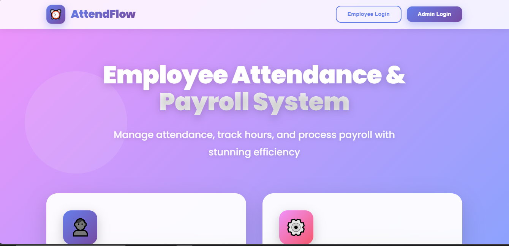

[](https://reactjs.org/)
[](https://nodejs.org/)
[](https://www.mysql.com/)
[](https://expressjs.com/)
[](LICENSE)

[Features](#-features) • [Demo](#-screenshots) • [Installation](#-installation) • [Usage](#-usage) • [API Docs](#-api-documentation)

</div>

---

## 📖 Table of Contents

- [Overview](#-overview)
- [Key Features](#-key-features)
- [Screenshots](#-screenshots)
- [Tech Stack](#-tech-stack)
- [Installation Guide](#-installation-guide)
- [Usage](#-usage)
- [API Documentation](#-api-documentation)
- [Database Schema](#-database-schema)
- [Project Structure](#-project-structure)
- [Contributing](#-contributing)
- [License](#-license)
- [Contact](#-contact)

---

## 🌟 Overview

**Employee Attendance Management System** is a comprehensive, production-ready web application designed to streamline workforce management for modern organizations. Built with cutting-edge technologies, it provides an intuitive interface for both employees and administrators.

### 🎯 Why Choose This System?

| Aspect | Benefit |
|--------|---------|
| 🚀 **Performance** | Optimized for high-traffic environments with efficient database queries |
| 🔒 **Security** | JWT authentication, password hashing, and role-based access control |
| 📊 **Insights** | Generate comprehensive reports in Excel and PDF formats |
| 💼 **User-Friendly** | Intuitive interface designed for non-technical users |
| 🔧 **Maintainable** | Clean code architecture with proper separation of concerns |
| 📱 **Responsive** | Works seamlessly across desktop, tablet, and mobile devices |

---

## ✨ Key Features

<table>
<tr>
<td width="50%">

### 👨‍💼 Employee Portal

- ⏰ **Smart Attendance**
  - One-click clock in/out
  - Automatic time calculation
  - Real-time status updates
  
- 📝 **Leave Management**
  - Apply for multiple leave types
  - Upload supporting documents
  - Track application status
  
- 💰 **Payroll Access**
  - View salary breakdowns
  - Download PDF pay slips
  - Access historical records

- 📊 **Personal Dashboard**
  - Leave balance overview
  - Attendance history
  - Performance metrics

</td>
<td width="50%">

### 👔 Admin Dashboard

- ✅ **Approval Workflow**
  - Review leave requests
  - Approve/reject with comments
  - Bulk processing options
  
- 👥 **Employee Management**
  - Add/Edit/Delete employees
  - Advanced search filters
  - Department-wise grouping
  
- 💵 **Payroll Processing**
  - Generate salary slips
  - Calculate deductions
  - Tax computation
  
- 📥 **Advanced Reports**
  - Excel exports with styling
  - PDF reports with branding
  - Custom date range filters
  - Employee-specific analytics

</td>
</tr>
</table>

---

## 📸 Screenshots

### 🏠 Landing Page
<div align="center">

<p><em>Professional landing page with modern design</em></p>
</div>

### 🔐 Authentication
<table>
<tr>
<td width="50%">
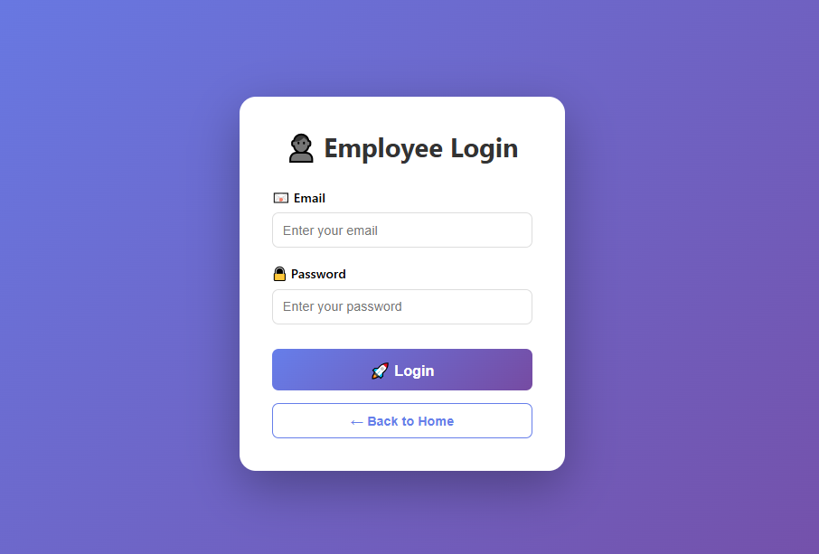
<p align="center"><em>Employee Login Portal</em></p>
</td>
<td width="50%">
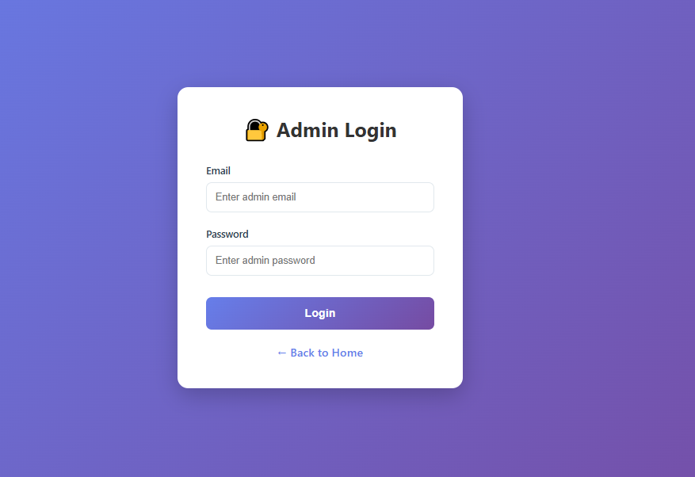
<p align="center"><em>Admin Login Portal</em></p>
</td>
</tr>
</table>

### 👨‍💼 Employee Dashboard
<div align="center">
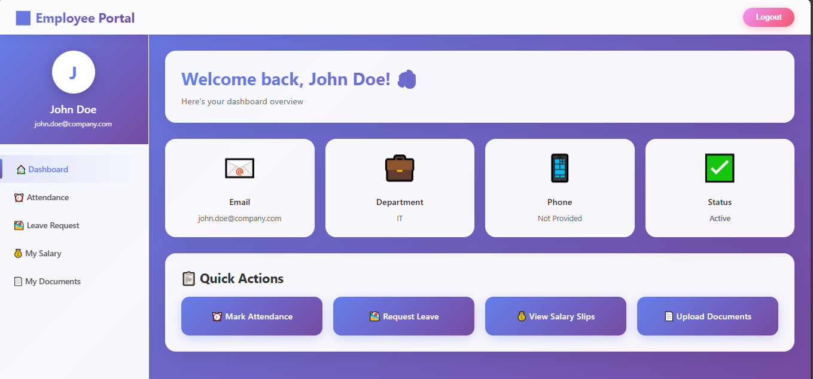
<p><em>Comprehensive employee dashboard with quick actions</em></p>
</div>

### 👔 Admin Control Panel
<div align="center">
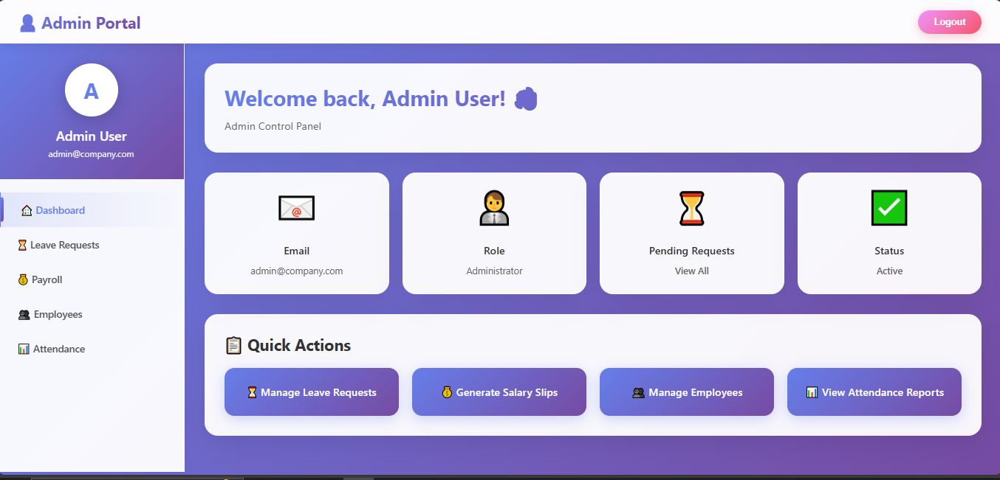
<p><em>Powerful admin dashboard with management tools</em></p>
</div>

### ⏰ Attendance Management
<table>
<tr>
<td width="50%">
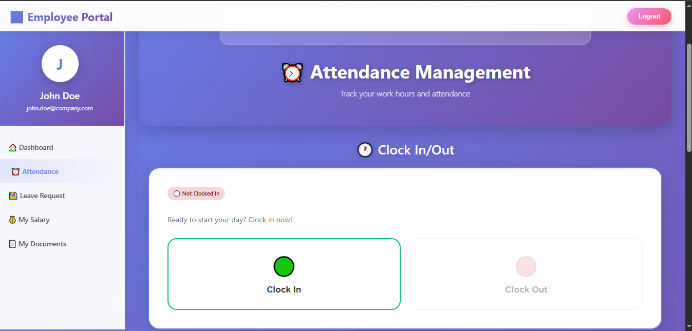
<p align="center"><em>Attendance Tracking Interface</em></p>
</td>
<td width="50%">
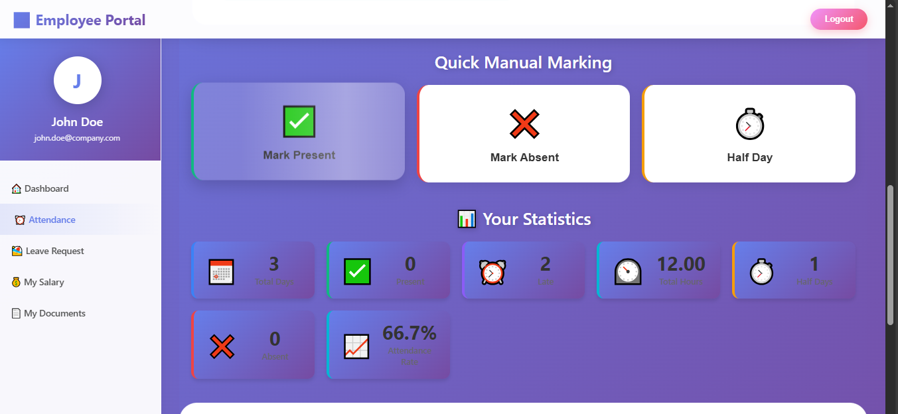
<p align="center"><em>Detailed Attendance Records</em></p>
</td>
</tr>
</table>

<div align="center">
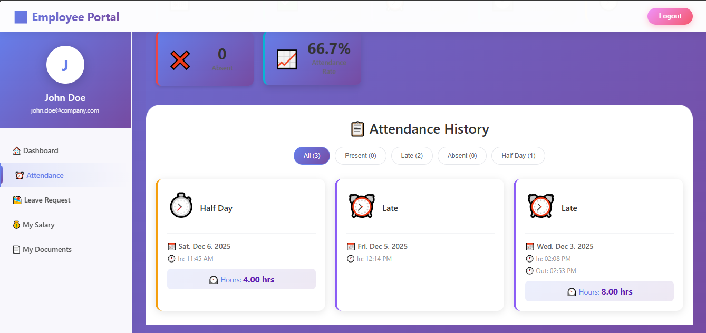
<p><em>Comprehensive attendance reports with filters</em></p>
</div>

### 📝 Leave Management System
<table>
<tr>
<td width="50%">
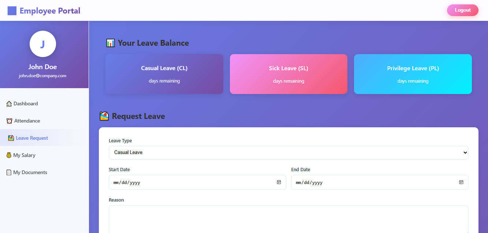
<p align="center"><em>Leave Application Interface</em></p>
</td>
<td width="50%">
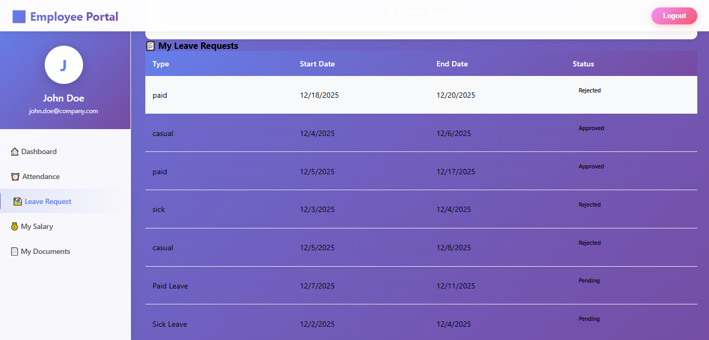
<p align="center"><em>Leave Status Tracking</em></p>
</td>
</tr>
</table>

<div align="center">
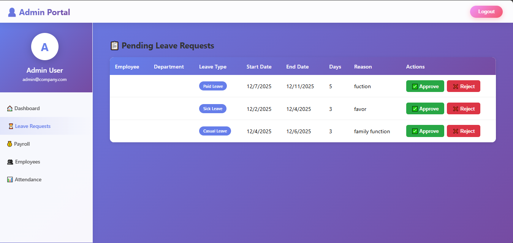
<p><em>Admin leave approval portal</em></p>
</div>

### 💰 Payroll System
<table>
<tr>
<td width="50%">
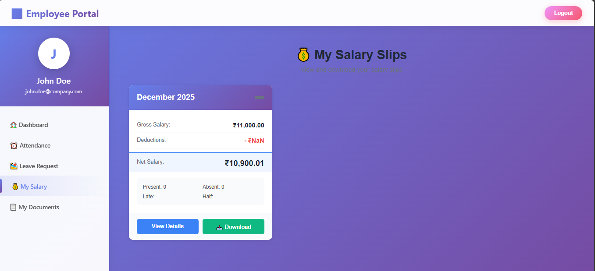
<p align="center"><em>Salary Slip Generation</em></p>
</td>
<td width="50%">
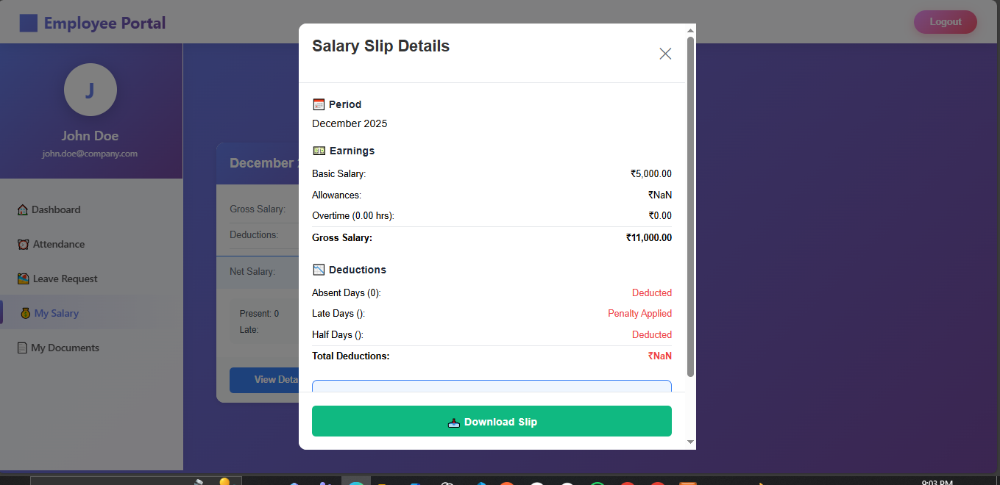
<p align="center"><em>Detailed Payroll Information</em></p>
</td>
</tr>
</table>

<table>
<tr>
<td width="50%">
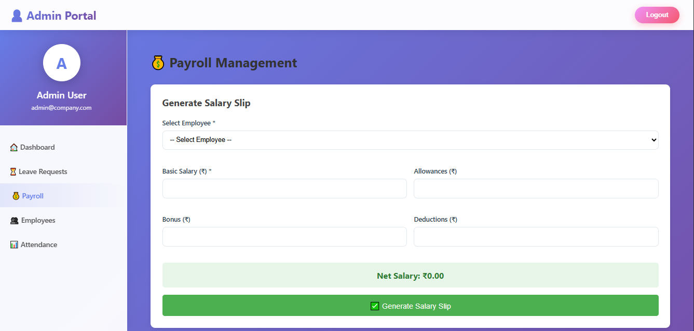
<p align="center"><em>Payroll Overview Dashboard</em></p>
</td>
<td width="50%">
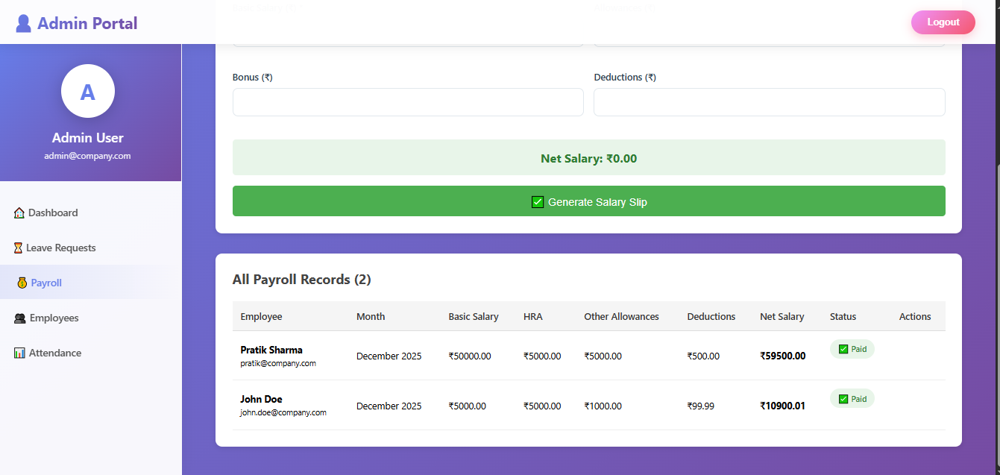
<p align="center"><em>Payroll Processing Interface</em></p>
</td>
</tr>
</table>

### 📄 Document Management
<table>
<tr>
<td width="50%">

<p align="center"><em>Document Upload Interface</em></p>
</td>
<td width="50%">
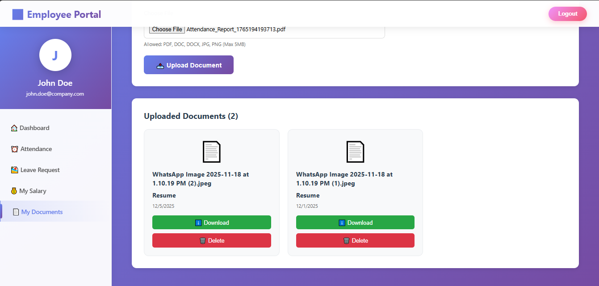
<p align="center"><em>Document Management System</em></p>
</td>
</tr>
</table>

### 👥 Employee Management
<table>
<tr>
<td width="50%">

<p align="center"><em>Employee Details Management</em></p>
</td>
<td width="50%">
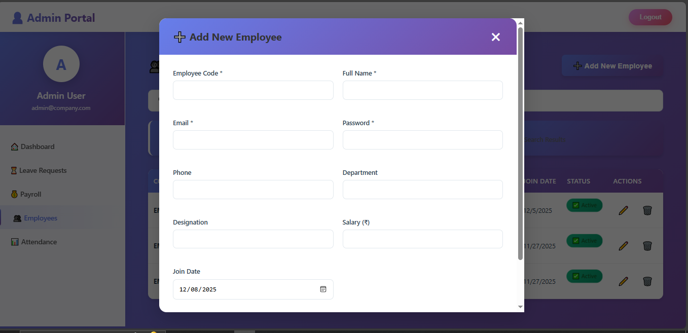
<p align="center"><em>Comprehensive Employee Information</em></p>
</td>
</tr>
</table>

### 📊 Detailed Analytics
<table>
<tr>
<td width="50%">
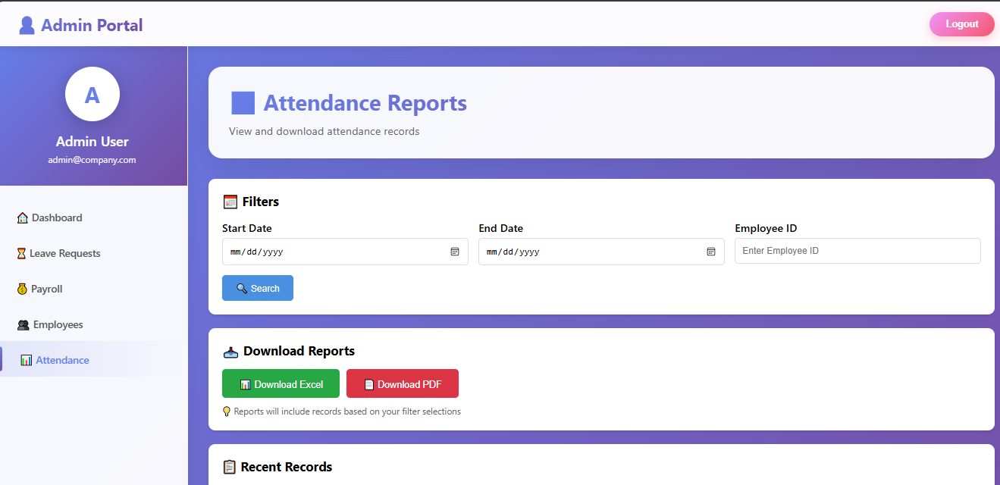
<p align="center"><em>Attendance Analytics Dashboard</em></p>
</td>
<td width="50%">
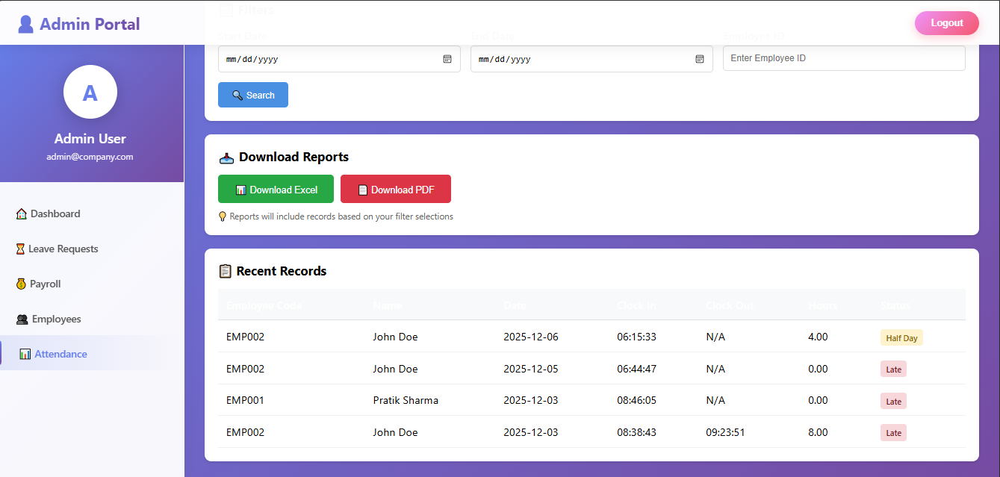
<p align="center"><em>Detailed Performance Reports</em></p>
</td>
</tr>
</table>

---

## 🛠️ Tech Stack

### Frontend Architecture

⚛️  React 18.x          - Modern UI library with hooks
🎨  CSS3                - Custom styling with Flexbox/Grid
🔀  React Router v6     - Client-side routing
📡  Axios               - Promise-based HTTP client
🎭  React Context API   - State management
📱  Responsive Design   - Mobile-first approach


### Backend Infrastructure

🟢  Node.js 16.x        - JavaScript runtime
🚂  Express.js 4.x      - Web application framework
🔐  JWT                 - JSON Web Token authentication
🔒  bcrypt              - Password hashing
📤  Multer              - Multipart file uploads
📊  ExcelJS             - Excel spreadsheet generation
📄  PDFKit              - PDF document creation
✉️  Nodemailer          - Email notification system


### Database & ORM

🗄️  MySQL 8.x           - Relational database
🔄  Sequelize 6.x       - Promise-based ORM
📦  Connection Pool     - Optimized DB connections
🔍  Query Optimization  - Indexed queries


### Development Tools

📝  dotenv              - Environment variable management
🐛  Morgan              - HTTP request logger
✅  express-validator   - Input validation
🚀  PM2                 - Process manager (production)


---

## 📦 Installation Guide

### Prerequisites

Ensure you have the following installed on your system:

| Software | Version | Download Link |
|----------|---------|---------------|
| Node.js | 16.x or higher | [nodejs.org](https://nodejs.org/) |
| MySQL | 8.x or higher | [mysql.com](https://dev.mysql.com/downloads/) |
| Git | Latest | [git-scm.com](https://git-scm.com/) |
| npm/yarn | Latest | Comes with Node.js |

---

### 🔧 Step-by-Step Installation

#### 1️⃣ Clone the Repository

```bash
git clone https://github.com/Pratikg27/attendance-system.git
cd attendance-system

2️⃣ Backend Setup

# Navigate to backend directory
cd backend

# Install dependencies
npm install

# Install additional packages
npm install exceljs pdfkit multer

Create .env file in backend directory:

# Database Configuration
DB_NAME=attendance_db
DB_USER=root
DB_PASSWORD=your_mysql_password
DB_HOST=localhost
DB_PORT=3306

# JWT Secret (Change this in production!)
JWT_SECRET=your_super_secret_jwt_key_change_in_production_2024

# Server Configuration
PORT=5000
NODE_ENV=development

# File Upload Settings
UPLOAD_PATH=./uploads
MAX_FILE_SIZE=5242880

# Email Configuration (Optional)
EMAIL_HOST=smtp.gmail.com
EMAIL_PORT=587
EMAIL_USER=your-email@gmail.com
EMAIL_PASS=your-email-password

Create MySQL Database:

CREATE DATABASE attendance_db CHARACTER SET utf8mb4 COLLATE utf8mb4_unicode_ci;

Start Backend Server:

npm start

✅ Backend running at: http://localhost:5000

3️⃣ Frontend Setup

# Open new terminal and navigate to frontend
cd frontend

# Install dependencies
npm install

Configure API Endpoint:

Edit frontend/src/api.js:

const API_BASE_URL = 'http://localhost:5000/api';

Start Frontend Server:

npm start

✅ Frontend running at: http://localhost:3000

🔐 Usage
Default Login Credentials
👔 Administrator Account

Email:    admin@company.com
Password: admin123
Role:     Admin

Admin Capabilities:

View all employee records
Approve/reject leave requests
Generate salary slips
Download attendance reports (Excel/PDF)
Manage employee information
👨‍💼 Employee Account

Email:    john.doe@company.com
Password: password123
Role:     Employee

Employee Capabilities:

Clock in/out
Apply for leave
View leave balance
Download salary slips
Check attendance history
🎯 API Documentation
🔑 Authentication
General Login

POST /api/auth/login
Content-Type: application/json

Request Body:
{
  "email": "user@company.com",
  "password": "password123",
  "role": "employee"
}

Response:
{
  "token": "eyJhbGciOiJIUzI1NiIs...",
  "user": {
    "id": 1,
    "name": "John Doe",
    "email": "john.doe@company.com",
    "role": "employee"
  }
}

Admin Login

POST /api/admin/login
Content-Type: application/json

Request Body:
{
  "email": "admin@company.com",
  "password": "admin123"
}

Response:
{
  "token": "eyJhbGciOiJIUzI1NiIs...",
  "admin": {
    "id": 1,
    "email": "admin@company.com",
    "role": "admin"
  }
}

👨‍💼 Employee Endpoints
Get Leave Balance

GET /api/leaves/balance
Authorization: Bearer {token}

Response:
{
  "sick_leave": 10,
  "casual_leave": 12,
  "annual_leave": 15
}

Apply for Leave

POST /api/leaves/apply
Authorization: Bearer {token}
Content-Type: multipart/form-data

Form Data:
- leave_type: "Sick Leave"
- start_date: "2024-01-15"
- end_date: "2024-01-17"
- reason: "Medical appointment"
- document: [file]

Response:
{
  "success": true,
  "message": "Leave application submitted",
  "leaveId": 123
}

Get My Leaves

GET /api/leaves/my-leaves
Authorization: Bearer {token}

Response:
{
  "leaves": [
    {
      "leave_id": 1,
      "leave_type": "Sick Leave",
      "start_date": "2024-01-15",
      "end_date": "2024-01-17",
      "status": "Approved",
      "admin_comment": "Get well soon"
    }
  ]
}

Get Salary Slips

GET /api/payroll/my-slips
Authorization: Bearer {token}

Response:
{
  "slips": [
    {
      "payroll_id": 1,
      "month": "December",
      "year": 2024,
      "net_salary": 50000,
      "generated_date": "2024-12-01"
    }
  ]
}

👔 Admin Endpoints
Get All Employees

GET /api/admin/employees
Authorization: Bearer {admin_token}

Response:
{
  "employees": [
    {
      "employee_id": 1,
      "name": "John Doe",
      "department": "Engineering",
      "designation": "Senior Developer"
    }
  ]
}

Get Pending Leave Requests

GET /api/admin/leaves/pending
Authorization: Bearer {admin_token}

Response:
{
  "pending_leaves": [
    {
      "leave_id": 5,
      "employee_name": "Jane Smith",
      "leave_type": "Annual Leave",
      "start_date": "2024-01-20",
      "total_days": 5,
      "reason": "Family vacation"
    }
  ]
}

Update Leave Status

PUT /api/admin/leaves/update-status/:leaveId
Authorization: Bearer {admin_token}
Content-Type: application/json

Request Body:
{
  "status": "approved",
  "admin_comment": "Approved. Enjoy your vacation!"
}

Response:
{
  "success": true,
  "message": "Leave status updated"
}

Get Attendance Records

GET /api/admin/attendance
Authorization: Bearer {admin_token}
Query Parameters:
  - startDate: 2024-01-01
  - endDate: 2024-01-31
  - employeeId: 1 (optional)

Response:
{
  "success": true,
  "records": [
    {
      "attendance_id": 1,
      "employee_name": "John Doe",
      "date": "2024-01-15",
      "clock_in_time": "09:00:00",
      "clock_out_time": "18:00:00",
      "total_hours": "9.00",
      "status": "Present"
    }
  ]
}

Download Excel Report

GET /api/admin/attendance/download/excel
Authorization: Bearer {admin_token}
Query Parameters:
  - startDate: 2024-01-01
  - endDate: 2024-01-31
  - employeeId: 1 (optional)

Response: Excel file download

Download PDF Report

GET /api/admin/attendance/download/pdf
Authorization: Bearer {admin_token}
Query Parameters:
  - startDate: 2024-01-01
  - endDate: 2024-01-31
  - employeeId: 1 (optional)

Response: PDF file download

🗄️ Database Schema
Entity Relationship Diagram
┌─────────────┐         ┌──────────────┐         ┌─────────────┐
│  employees  │1      *│  attendance  │         │   leaves    │
│─────────────│◄────────│──────────────│         │─────────────│
│ employee_id │         │ attendance_id│         │ leave_id    │
│ name        │         │ employee_id  │         │ employee_id │
│ email       │         │ clock_in     │         │ leave_type  │
│ department  │         │ clock_out    │         │ start_date  │
│ role        │         │ total_hours  │         │ end_date    │
└─────────────┘         │ status       │         │ status      │
      │                 └──────────────┘         └─────────────┘
      │                                                 ▲
      │                                                 │
      │                 ┌──────────────┐               │
      └────────────────►│   payroll    │               │
                      *│──────────────│*              │
                        │ payroll_id   │───────────────┘
                        │ employee_id  │
                        │ month        │
                        │ net_salary   │
                        └──────────────┘

Table Structures
📋 employees

CREATE TABLE employees (
  employee_id INT PRIMARY KEY AUTO_INCREMENT,
  employee_code VARCHAR(50) UNIQUE NOT NULL,
  name VARCHAR(100) NOT NULL,
  email VARCHAR(100) UNIQUE NOT NULL,
  password VARCHAR(255) NOT NULL,
  department VARCHAR(50),
  designation VARCHAR(50),
  phone VARCHAR(15),
  date_of_joining DATE,
  role ENUM('employee', 'admin') DEFAULT 'employee',
  is_active BOOLEAN DEFAULT TRUE,
  created_at TIMESTAMP DEFAULT CURRENT_TIMESTAMP,
  updated_at TIMESTAMP DEFAULT CURRENT_TIMESTAMP ON UPDATE CURRENT_TIMESTAMP,
  INDEX idx_email (email),
  INDEX idx_department (department)
);

⏰ attendance

CREATE TABLE attendance (
  attendance_id INT PRIMARY KEY AUTO_INCREMENT,
  employee_id INT NOT NULL,
  clock_in DATETIME NOT NULL,
  clock_out DATETIME,
  total_hours DECIMAL(5,2),
  status ENUM('Present', 'Late', 'Half Day', 'Absent') DEFAULT 'Present',
  created_at TIMESTAMP DEFAULT CURRENT_TIMESTAMP,
  updated_at TIMESTAMP DEFAULT CURRENT_TIMESTAMP ON UPDATE CURRENT_TIMESTAMP,
  FOREIGN KEY (employee_id) REFERENCES employees(employee_id) ON DELETE CASCADE,
  INDEX idx_employee_date (employee_id, clock_in),
  INDEX idx_date (clock_in)
);

📝 leaves

CREATE TABLE leaves (
  leave_id INT PRIMARY KEY AUTO_INCREMENT,
  employee_id INT NOT NULL,
  leave_type ENUM('Sick Leave', 'Casual Leave', 'Annual Leave', 'Maternity Leave', 'Paternity Leave') NOT NULL,
  start_date DATE NOT NULL,
  end_date DATE NOT NULL,
  total_days INT NOT NULL,
  reason TEXT,
  status ENUM('Pending', 'Approved', 'Rejected') DEFAULT 'Pending',
  admin_comment TEXT,
  document_path VARCHAR(255),
  applied_date TIMESTAMP DEFAULT CURRENT_TIMESTAMP,
  approved_by INT,
  approved_date DATETIME,
  FOREIGN KEY (employee_id) REFERENCES employees(employee_id) ON DELETE CASCADE,
  FOREIGN KEY (approved_by) REFERENCES employees(employee_id),
  INDEX idx_employee (employee_id),
  INDEX idx_status (status),
  INDEX idx_dates (start_date, end_date)
);

💰 payroll

CREATE TABLE payroll (
  payroll_id INT PRIMARY KEY AUTO_INCREMENT,
  employee_id INT NOT NULL,
  month VARCHAR(20) NOT NULL,
  year INT NOT NULL,
  basic_salary DECIMAL(10,2) NOT NULL,
  allowances DECIMAL(10,2) DEFAULT 0,
  deductions DECIMAL(10,2) DEFAULT 0,
  gross_salary DECIMAL(10,2) NOT NULL,
  net_salary DECIMAL(10,2) NOT NULL,
  generated_date TIMESTAMP DEFAULT CURRENT_TIMESTAMP,
  FOREIGN KEY (employee_id) REFERENCES employees(employee_id) ON DELETE CASCADE,
  INDEX idx_employee_period (employee_id, year, month),
  UNIQUE KEY unique_payroll (employee_id, year, month)
);

⏱️ overtime (Future Enhancement)

CREATE TABLE overtime (
  overtime_id INT PRIMARY KEY AUTO_INCREMENT,
  employee_id INT NOT NULL,
  date DATE NOT NULL,
  hours DECIMAL(5,2) NOT NULL,
  rate DECIMAL(10,2) NOT NULL,
  amount DECIMAL(10,2) NOT NULL,
  approved BOOLEAN DEFAULT FALSE,
  created_at TIMESTAMP DEFAULT CURRENT_TIMESTAMP,
  FOREIGN KEY (employee_id) REFERENCES employees(employee_id) ON DELETE CASCADE,
  INDEX idx_employee_date (employee_id, date)
);

📁 Project Structure
attendance-system/
│
├── backend/
│   ├── config/
│   │   └── database.js              # Database configuration
│   │
│   ├── middleware/
│   │   └── authMiddleware.js        # JWT verification & role checks
│   │
│   ├── models/
│   │   ├── index.js                 # Sequelize models export
│   │   ├── Employee.js              # Employee model
│   │   ├── Attendance.js            # Attendance model
│   │   ├── Leave.js                 # Leave model
│   │   └── Payroll.js               # Payroll model
│   │
│   ├── routes/
│   │   ├── authRoutes.js            # Authentication routes
│   │   ├── adminRoutes.js           # Admin-specific routes
│   │   ├── leaveRoutes.js           # Leave management routes
│   │   └── payrollRoutes.js         # Payroll routes
│   │
│   ├── uploads/                     # File upload directory
│   ├── .env                         # Environment variables (not in repo)
│   ├── server.js                    # Express server entry point
│   ├── package.json                 # Backend dependencies
│   └── package-lock.json
│
├── frontend/
│   ├── public/
│   │   ├── index.html               # HTML template
│   │   └── favicon.ico              # App favicon
│   │
│   ├── src/
│   │   ├── components/
│   │   │   ├── AdminDashboard.jsx   # Admin dashboard component
│   │   │   ├── EmployeeDashboard.jsx# Employee dashboard
│   │   │   ├── LeaveManagement.jsx  # Leave module
│   │   │   ├── AttendanceModule.jsx # Attendance tracking
│   │   │   ├── PayrollModule.jsx    # Payroll management
│   │   │   └── EmployeeManagement.jsx# Employee CRUD
│   │   │
│   │   ├── pages/
│   │   │   ├── HomePage.jsx         # Landing page
│   │   │   ├── EmployeeLogin.jsx    # Employee login
│   │   │   └── AdminLogin.jsx       # Admin login
│   │   │
│   │   ├── styles/
│   │   │   ├── AdminDashboard.css
│   │   │   ├── EmployeeDashboard.css
│   │   │   └── HomePage.css
│   │   │
│   │   ├── api.js                   # Axios API configuration
│   │   ├── App.jsx                  # Main App component
│   │   └── main.jsx                 # React entry point
│   │
│   ├── package.json                 # Frontend dependencies
│   └── package-lock.json
│
├── screenshots/                     # Application screenshots
│   ├── HomePage.PNG
│   ├── AdminPortal.PNG
│   ├── EmployeePortal.PNG
│   └── ... (22 screenshots total)
│
├── .gitignore                       # Git ignore rules
├── README.md                        # This file
└── test-api.html                    # API testing tool

🔒 Security Features
Authentication & Authorization
✅ JWT Tokens - Stateless authentication with expiration
✅ Password Hashing - bcrypt with salt rounds
✅ Role-Based Access - Employee vs Admin permissions
✅ Token Refresh - Automatic token renewal
✅ Session Management - Secure session handling
Data Protection
✅ SQL Injection Prevention - Parameterized queries
✅ XSS Protection - Input sanitization
✅ CSRF Tokens - Cross-site request forgery prevention
✅ File Upload Validation - Type and size restrictions
✅ Environment Variables - Sensitive data protection
API Security
✅ Rate Limiting - Prevent abuse
✅ CORS Configuration - Controlled access
✅ HTTPS Support - Encrypted communication
✅ Helmet.js - Security headers
🚀 Deployment
Production Checklist
Environment Setup

[ ] Change JWT_SECRET to strong random string
[ ] Update database credentials
[ ] Configure CORS for production domain
[ ] Set NODE_ENV to 'production'
[ ] Enable HTTPS/SSL
[ ] Configure file storage (AWS S3/Azure Blob)
Database

[ ] Enable SSL connections
[ ] Set up automated backups
[ ] Configure connection pooling
[ ] Create database indexes
[ ] Set up replication (optional)
Performance

[ ] Enable Redis caching
[ ] Implement CDN for static assets
[ ] Configure load balancer
[ ] Set up monitoring (PM2/New Relic)
[ ] Enable gzip compression
Security

[ ] Implement rate limiting
[ ] Add API throttling
[ ] Configure firewall rules
[ ] Set up intrusion detection
[ ] Enable logging and monitoring
🤝 Contributing
Contributions are what make the open-source community such an amazing place to learn, inspire, and create. Any contributions you make are greatly appreciated.

How to Contribute
Fork the Project
# Click the 'Fork' button on GitHub
Clone Your Fork
git clone https://github.com/YOUR_USERNAME/attendance-system.git
cd attendance-system
Create Feature Branch
git checkout -b feature/AmazingFeature
Make Your Changes
Write clean, documented code
Follow existing code style
Add tests if applicable
Commit Changes
git add .
git commit -m 'Add some AmazingFeature'
Push to Branch
git push origin feature/AmazingFeature
Open Pull Request
Go to original repository
Click 'New Pull Request'
Describe your changes
Development Guidelines
✅ Follow JavaScript ES6+ standards
✅ Write meaningful commit messages
✅ Add comments for complex logic
✅ Test thoroughly before submitting
✅ Update documentation if needed
📝 License
This project is licensed under the MIT License.

MIT License

Copyright (c) 2024 Pratik Gunjal

Permission is hereby granted, free of charge, to any person obtaining a copy
of this software and associated documentation files (the "Software"), to deal
in the Software without restriction, including without limitation the rights
to use, copy, modify, merge, publish, distribute, sublicense, and/or sell
copies of the Software, and to permit persons to whom the Software is
furnished to do so, subject to the following conditions:

The above copyright notice and this permission notice shall be included in all
copies or substantial portions of the Software.

THE SOFTWARE IS PROVIDED "AS IS", WITHOUT WARRANTY OF ANY KIND, EXPRESS OR
IMPLIED, INCLUDING BUT NOT LIMITED TO THE WARRANTIES OF MERCHANTABILITY,
FITNESS FOR A PARTICULAR PURPOSE AND NONINFRINGEMENT. IN NO EVENT SHALL THE
AUTHORS OR COPYRIGHT HOLDERS BE LIABLE FOR ANY CLAIM, DAMAGES OR OTHER
LIABILITY, WHETHER IN AN ACTION OF CONTRACT, TORT OR OTHERWISE, ARISING FROM,
OUT OF OR IN CONNECTION WITH THE SOFTWARE OR THE USE OR OTHER DEALINGS IN THE
SOFTWARE.

👨‍💻 Author
Pratik Gunjal
Full-Stack Developer | MERN Stack Enthusiast | Open Source Contributor

https://github.com/Pratikg27
mailto:pratikgunnjal2127@gmail.com
https://linkedin.com/in/pratikgunjal

🙏 Acknowledgments
This project was built with the help of amazing open-source technologies:

Core Technologies
https://reactjs.org/ - UI library
https://nodejs.org/ - JavaScript runtime
https://expressjs.com/ - Web framework
https://www.mysql.com/ - Database
https://sequelize.org/ - ORM
Libraries & Tools
https://github.com/exceljs/exceljs - Excel generation
https://pdfkit.org/ - PDF creation
https://github.com/expressjs/multer - File uploads
https://github.com/kelektiv/node.bcrypt.js - Password hashing
https://github.com/auth0/node-jsonwebtoken - JWT authentication
https://axios-http.com/ - HTTP client
Resources
https://react.dev/
https://github.com/goldbergyoni/nodebestpractices
https://dev.mysql.com/doc/
https://developer.mozilla.org/
📞 Support & Feedback
Need Help?
📧 Email: mailto:pratikgunnjal2127@gmail.com
🐛 Bug Reports: https://github.com/Pratikg27/attendance-system/issues
💡 Feature Requests: https://github.com/Pratikg27/attendance-system/discussions
📖 Documentation: https://github.com/Pratikg27/attendance-system/wiki
Found This Helpful?
If this project helped you, please consider:

⭐ Starring the repository
🍴 Forking for your own projects
📢 Sharing with others
💰 Sponsoring the development
🗺️ Roadmap
Planned Features
[ ] Mobile application (React Native)
[ ] Real-time notifications
[ ] Advanced analytics dashboard
[ ] Multi-language support
[ ] Dark mode theme
[ ] Biometric authentication
[ ] Geolocation tracking
[ ] Shift management
[ ] Integration with HR systems
[ ] AI-powered insights
📊 Project Stats


⭐ Star this repository if you find it helpful!
Made with ❤️ by https://github.com/Pratikg27

Employee Attendance Management System © 2025